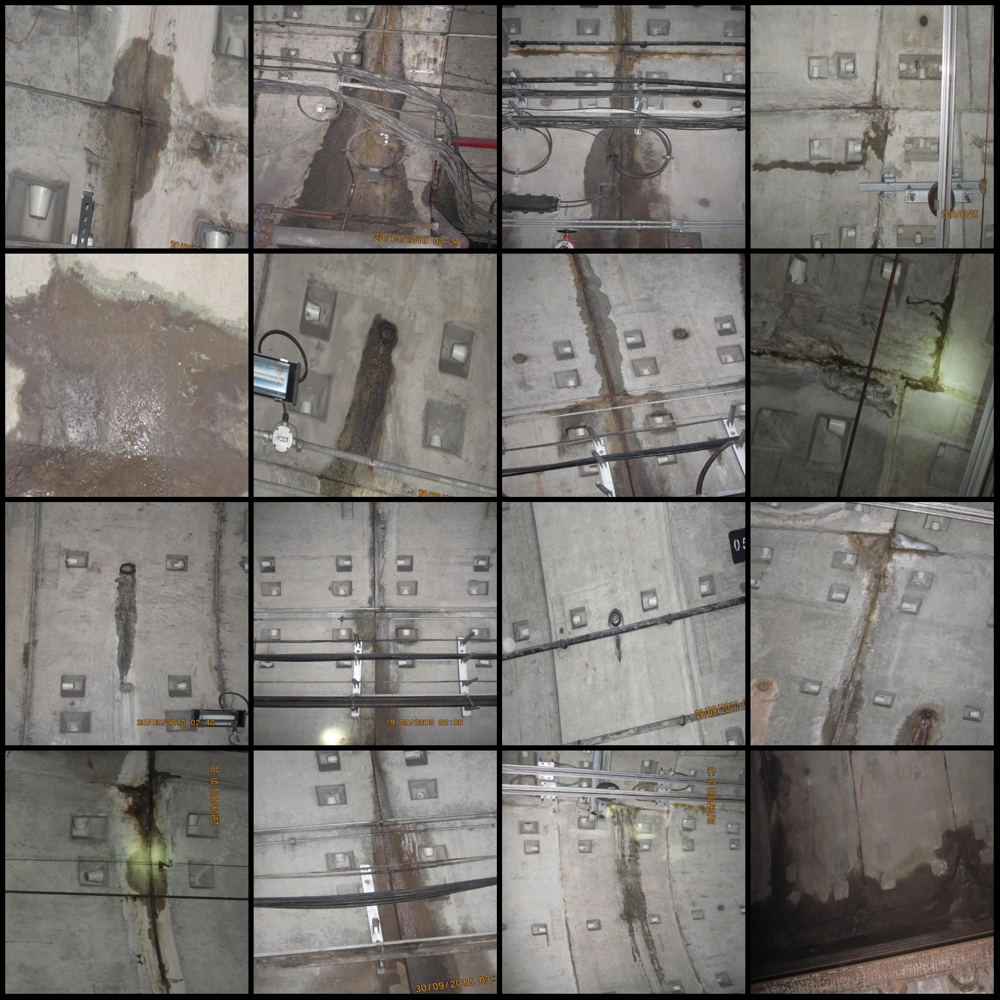
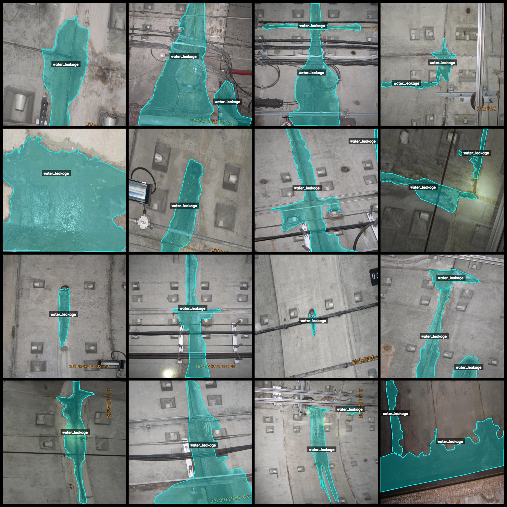
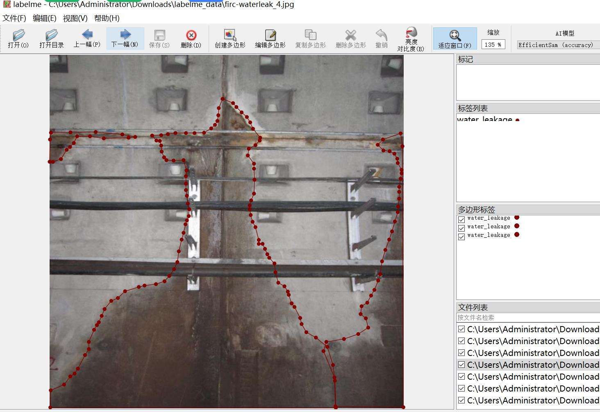

# Highway Tunnel, Railway Tunnel, Subway Tunnel Leakage Identification and Segmentation Data Set - LabelMe Format - 2758 Images in One Category

Dataset Format: LabelMe format (excluding mask files, only containing JPG images and corresponding JSON files).
Number of Image Files: 2758.
Number of Annotations: 2758.
Number of Annotation Categories: 1.
Annotation Category Name: ["water_leakage"].
Number of Boxes for Each Category:
water_leakage count = 4601.
Total Boxes: 4601.
Annotation Tool Used: labelme=5.5.0.
Image Resolution: 640x640.
Annotation Rules: Polygon is drawn around the category.
Important Notice: The dataset can be edited using LabelMe, but the JSON dataset needs to be converted into a format like Mask or Yolo or COCO for semantic segmentation or instance segmentation.
Special Disclaimer: This dataset does not guarantee the accuracy of the trained model or weight files.
Image Preview:
Annotation Example:
Original Image (randomly selected 16 images):
Annotation Drawing Results:
LabelMe Editing Image Example:

## Images

Here is a pay link on Stripe ( https://buy.stripe.com/3cs8yP7sY87d0vu9AB ). Please contact me lonlonago@foxmail.com after funding $89, and I will send you a complete data files , thank you!

